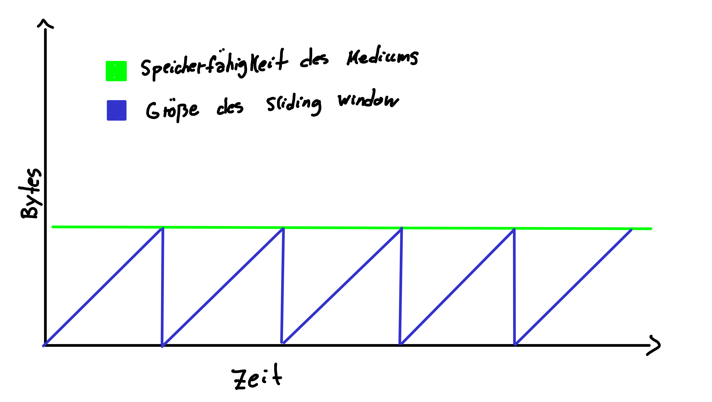

# Hausaufgabe 6

## Aufgabe 1

### Sliding Window, TCP Tahoe, TCP Reno, TCP Vegas

Das TCP-Protokoll spezifiziert ein Anzahl an Bytes, die ohne eine Empfangsbestätigung übertragen werden können.
Diese Anzahl ist flexibel und wird deswegen auch Sliding Window genannt.
Diese Technik hilft dabei die speicherfähigkeit des Mediums besser auszunutzen.
Tahoe, Reno und Vegas sind Algorithmen, die die Größe des Sliding-Window bestimmen.
Sie nutzen dabei unterschiedliche Heuristiken.
TCP Tahoe vergrößert das Sliding-Window, bis es drei duppizierte Acks erhält.
Dann setzt es die Größe 1 und beginnt das Febster linear zu vergrößern.
Dies ist in der folgenden Grafik zu erkennen



### Liste von Protokollen und das entsprechende ISO/OSI Layer

| Protokoll  | ISO/OSI Schicht   |
|------------|-------------------|
| IEEE 802.3 | Data-Link-Layer   |
| ARP/RARP   | Data-Link-Layer   |
| IP         | Network-Layer     |
| ICMP       | Network-Layer     |
| UDP        | Transport-Layer   |
| TCP        | Transport-Layer   |
| QUIC       | Application-Layer |
| DHCP       | Application-Layer |
| DNS        | Application-Layer |

## Aufgabe 2

### a)

Wie viele Hosts sich in meinem Klasse-C Netz befinden, kann mit dem Befehl

```bash
sudo nmap -sP 192.168.0.0/24 | grep "scan report" | wc -l
```

in Erfahrung gebracht werden. Mobile Endgeräte werden aber über Ping Scans nur bedingt gut erfasst und so kann es zu unterschiedlichen Ergebissen kommen.

### b)

Das Betriebssystem kann mit dem Nmap Befehl

```bash
sudo nmap -O scanme.nmap.org
```

In Erfahrung gebracht werden.

### c)

Wir können mit dem Befehl

```bash
whois nmap.org
```

herausfinden, wann die Website registriert wurde. (18.01.1999)

### d)

Um eine große Anzahl Adressen nach offenen TCP-Ports zu scannen können wir einen sogenannten SYN-Scan verwenden.
Diesen führt nmap standartmäßig aus, wenn es mit root Rechten gestartet wird.
Wir können die Option aber auch explizit angeben.
Den Adressraum können wir durch CIDR-Notation spezifizieren.

```bash
sudo nmap -sS 192.168.0.0/24
```

### e)

Der SYN-Scan schickt ein SYN-Paket an einen Port.
Dieser Antwortet, wenn er offen ist, mit einem SYN/ACK-Paket.
Ist er geschlossen wird mit einem RST-Paket geantwortet.
Erhält man keine Antwort oder erhält man einen ICMP unreachable Fehler wird der Port als gefiltert markiert.

Der SYN-Scan nutzt aus, dass TCP-Verbindungen im halboffenen Zustand verbleiben können, denn Nmap antwortet auf das erhaltenen SYN/ACK nicht mit einem ACK-Paket. Dies ermöglicht das schnelle Scannen von vielen Ports.

### f)

| Port      | Anwendung |
|-----------|-----------|
| 22/tcp    | ssh       |
| 53/tcp    | DNS       |
| 67-68/udp | DHCP      |
| 80/tcp    | http      |

## Aufgabe 3

Für das Aufzeichnen der DHCP-Pakete kann man den folgenden Capture-Filter verwenden `port 67 or port 68`.
Da der DHCP Server Port 67 und der DHCP Client Port 68 nutzt, kann man so DHCP Pakete aufzeichnen.
Um DHCP Pakete aufzuzeichnen, fordern wir den DHCP Server auf uns eine neue IP-Adresse mitzuteilen.
Dies können wir mit den Befehlen

```bash
sudo dhclient -r
sudo dhclient <network interface>
```

Dies führt zu folgender Aufzeichnung und zeigt exemplarisch den Ablauf eines DHCP Verbindungsaufbaus.

### Release (optional)

Es wird dem DHCP Server mitgeteilt, dass er die IP-Adresse des Hosts wieder vergeben kann.
Dies ist eine optionale Operation, da ein Host nicht zwangsläufig seine IP-Adresse freigeben muss.
Im udp Header können wir sehen, dass sowohl die Ip des Hosts als auch die Ip des Servers bekannt ist.

```text
Frame 1: 342 bytes on wire (2736 bits), 342 bytes captured (2736 bits) on interface enp4s0, id 0
Ethernet II, Src: GigaByteTech_f4:ef:85 (b4:2e:99:f4:ef:85), Dst: Commscope_18:7f:96 (e4:f7:5b:18:7f:96)
Internet Protocol Version 4, Src: 192.168.0.21, Dst: 192.168.0.1
User Datagram Protocol, Src Port: 68, Dst Port: 67
Dynamic Host Configuration Protocol (Release)
    Message type: Boot Request (1)
    Hardware type: Ethernet (0x01)
    Hardware address length: 6
    Hops: 0
    Transaction ID: 0xda524f74
    Seconds elapsed: 0
    Bootp flags: 0x0000 (Unicast)
    Client IP address: 192.168.0.21
    Your (client) IP address: 0.0.0.0
    Next server IP address: 0.0.0.0
    Relay agent IP address: 0.0.0.0
    Client MAC address: GigaByteTech_f4:ef:85 (b4:2e:99:f4:ef:85)
    Client hardware address padding: 00000000000000000000
    Server host name not given
    Boot file name not given
    Magic cookie: DHCP
    Option: (53) DHCP Message Type (Release)
        Length: 1
        DHCP: Release (7)
    Option: (54) DHCP Server Identifier (192.168.0.1)
        Length: 4
        DHCP Server Identifier: 192.168.0.1
    Option: (12) Host Name
        Length: 10
        Host Name: paul-simon
    Option: (255) End
        Option End: 255
    Padding: 0000000000000000000000000000000000000000000000000000000000000000000000000000
```

### Discover

Der DHCP-Client schickt eine `Discover` Nachricht an die Broadcast-Adresse `255.255.255.255`.
Dies dient dazu, dass ein entsprechender DHCP-Server die Nachricht empfangen kann.
Dies ist auch der Grund, warum der DHCP-Server auf eine andere Port-Nummer nutzen muss, da sonst alles DHCP-Clients angesprochen werden würden.
Zu diesem Zeitpunkt ist die IP des DHCP-Clients unbekannt, weswegen die Absender-Adresse `0.0.0.0` zeigt.
Der Client fügt seine MAC-Adresse an, damit der Server in unter dieser erreichen kann.

```text
Frame 2: 342 bytes on wire (2736 bits), 342 bytes captured (2736 bits) on interface enp4s0, id 0
Ethernet II, Src: GigaByteTech_f4:ef:85 (b4:2e:99:f4:ef:85), Dst: Broadcast (ff:ff:ff:ff:ff:ff)
Internet Protocol Version 4, Src: 0.0.0.0, Dst: 255.255.255.255
User Datagram Protocol, Src Port: 68, Dst Port: 67
Dynamic Host Configuration Protocol (Discover)
    Message type: Boot Request (1)
    Hardware type: Ethernet (0x01)
    Hardware address length: 6
    Hops: 0
    Transaction ID: 0x45747628
    Seconds elapsed: 0
    Bootp flags: 0x0000 (Unicast)
    Client IP address: 0.0.0.0
    Your (client) IP address: 0.0.0.0
    Next server IP address: 0.0.0.0
    Relay agent IP address: 0.0.0.0
    Client MAC address: GigaByteTech_f4:ef:85 (b4:2e:99:f4:ef:85)
    Client hardware address padding: 00000000000000000000
    Server host name not given
    Boot file name not given
    Magic cookie: DHCP
    Option: (53) DHCP Message Type (Discover)
        Length: 1
        DHCP: Discover (1)
    Option: (50) Requested IP Address (192.168.0.21)
        Length: 4
        Requested IP Address: 192.168.0.21
    Option: (12) Host Name
        Length: 10
        Host Name: paul-simon
    Option: (55) Parameter Request List
        Length: 13
        Parameter Request List Item: (1) Subnet Mask
        Parameter Request List Item: (28) Broadcast Address
        Parameter Request List Item: (2) Time Offset
        Parameter Request List Item: (3) Router
        Parameter Request List Item: (15) Domain Name
        Parameter Request List Item: (6) Domain Name Server
        Parameter Request List Item: (119) Domain Search
        Parameter Request List Item: (12) Host Name
        Parameter Request List Item: (44) NetBIOS over TCP/IP Name Server
        Parameter Request List Item: (47) NetBIOS over TCP/IP Scope
        Parameter Request List Item: (26) Interface MTU
        Parameter Request List Item: (121) Classless Static Route
        Parameter Request List Item: (42) Network Time Protocol Servers
    Option: (255) End
        Option End: 255
    Padding: 0000000000000000000000000000000000000000000000
```

### Offer

Erhält der DHCP-Server eine `Discover` Nachricht erstellt er eine `Offer` Nachricht.
Hier bietet er dem Client eine gültige IP an.
Diese ist auch schon als Ziel-Adresse im udp Header zu finden.
Dass die Nachricht überhaupt ankommt, liegt an der MAC-Adresse die im Ethernet Header spezifiziert ist.
Es werden dem DHCP-Client auch weitere diverse Infomrationen mitgeteilt, wie zum Beispiel die IP eines DNS-Servers.

```text
Frame 4: 342 bytes on wire (2736 bits), 342 bytes captured (2736 bits) on interface enp4s0, id 0
Ethernet II, Src: Commscope_18:7f:96 (e4:f7:5b:18:7f:96), Dst: GigaByteTech_f4:ef:85 (b4:2e:99:f4:ef:85)
Internet Protocol Version 4, Src: 192.168.0.1, Dst: 192.168.0.22
User Datagram Protocol, Src Port: 67, Dst Port: 68
Dynamic Host Configuration Protocol (Offer)
    Message type: Boot Reply (2)
    Hardware type: Ethernet (0x01)
    Hardware address length: 6
    Hops: 0
    Transaction ID: 0x45747628
    Seconds elapsed: 0
    Bootp flags: 0x0000 (Unicast)
    Client IP address: 0.0.0.0
    Your (client) IP address: 192.168.0.22
    Next server IP address: 192.168.0.1
    Relay agent IP address: 0.0.0.0
    Client MAC address: GigaByteTech_f4:ef:85 (b4:2e:99:f4:ef:85)
    Client hardware address padding: 00000000000000000000
    Server host name not given
    Boot file name not given
    Magic cookie: DHCP
    Option: (53) DHCP Message Type (Offer)
        Length: 1
        DHCP: Offer (2)
    Option: (54) DHCP Server Identifier (192.168.0.1)
        Length: 4
        DHCP Server Identifier: 192.168.0.1
    Option: (51) IP Address Lease Time
        Length: 4
        IP Address Lease Time: 7 days (604800)
    Option: (58) Renewal Time Value
        Length: 4
        Renewal Time Value: 3 days, 12 hours (302400)
    Option: (59) Rebinding Time Value
        Length: 4
        Rebinding Time Value: 6 days, 3 hours (529200)
    Option: (1) Subnet Mask (255.255.255.0)
        Length: 4
        Subnet Mask: 255.255.255.0
    Option: (28) Broadcast Address (192.168.0.255)
        Length: 4
        Broadcast Address: 192.168.0.255
    Option: (3) Router
        Length: 4
        Router: 192.168.0.1
    Option: (6) Domain Name Server
        Length: 4
        Domain Name Server: 192.168.0.1
    Option: (42) Network Time Protocol Servers
        Length: 4
        Network Time Protocol Server: 192.168.0.1
    Option: (255) End
        Option End: 255
    Padding: 0000
```

### Request

Der DHCP-Client empfängt die `Offer` Nachricht und bestätigt diese mit einer `Request` Nachricht.

```text
Frame 5: 342 bytes on wire (2736 bits), 342 bytes captured (2736 bits) on interface enp4s0, id 0
Ethernet II, Src: GigaByteTech_f4:ef:85 (b4:2e:99:f4:ef:85), Dst: Broadcast (ff:ff:ff:ff:ff:ff)
Internet Protocol Version 4, Src: 0.0.0.0, Dst: 255.255.255.255
User Datagram Protocol, Src Port: 68, Dst Port: 67
Dynamic Host Configuration Protocol (Request)
    Message type: Boot Request (1)
    Hardware type: Ethernet (0x01)
    Hardware address length: 6
    Hops: 0
    Transaction ID: 0x45747628
    Seconds elapsed: 3
    Bootp flags: 0x0000 (Unicast)
    Client IP address: 0.0.0.0
    Your (client) IP address: 0.0.0.0
    Next server IP address: 0.0.0.0
    Relay agent IP address: 0.0.0.0
    Client MAC address: GigaByteTech_f4:ef:85 (b4:2e:99:f4:ef:85)
    Client hardware address padding: 00000000000000000000
    Server host name not given
    Boot file name not given
    Magic cookie: DHCP
    Option: (53) DHCP Message Type (Request)
        Length: 1
        DHCP: Request (3)
    Option: (54) DHCP Server Identifier (192.168.0.1)
        Length: 4
        DHCP Server Identifier: 192.168.0.1
    Option: (50) Requested IP Address (192.168.0.22)
        Length: 4
        Requested IP Address: 192.168.0.22
    Option: (12) Host Name
        Length: 10
        Host Name: paul-simon
    Option: (55) Parameter Request List
        Length: 13
        Parameter Request List Item: (1) Subnet Mask
        Parameter Request List Item: (28) Broadcast Address
        Parameter Request List Item: (2) Time Offset
        Parameter Request List Item: (3) Router
        Parameter Request List Item: (15) Domain Name
        Parameter Request List Item: (6) Domain Name Server
        Parameter Request List Item: (119) Domain Search
        Parameter Request List Item: (12) Host Name
        Parameter Request List Item: (44) NetBIOS over TCP/IP Name Server
        Parameter Request List Item: (47) NetBIOS over TCP/IP Scope
        Parameter Request List Item: (26) Interface MTU
        Parameter Request List Item: (121) Classless Static Route
        Parameter Request List Item: (42) Network Time Protocol Servers
    Option: (255) End
        Option End: 255
    Padding: 0000000000000000000000000000000000
```

### Acknowledge

Der DHCP-Server empfängt die `Request` Nachricht und fügt den Client und die zugeteilte IP seiner internen Liste hinzu.
Er bestätigt den Empfang mit einer `Acknowledge` Nachricht.
Bei Erhalt diese Nachricht wird der DHCP-Client seine IP entsprechend der getroffenen Vereinbarung festlegen.

```text
Frame 7: 352 bytes on wire (2816 bits), 352 bytes captured (2816 bits) on interface enp4s0, id 0
Ethernet II, Src: Commscope_18:7f:96 (e4:f7:5b:18:7f:96), Dst: GigaByteTech_f4:ef:85 (b4:2e:99:f4:ef:85)
Internet Protocol Version 4, Src: 192.168.0.1, Dst: 192.168.0.22
User Datagram Protocol, Src Port: 67, Dst Port: 68
Dynamic Host Configuration Protocol (ACK)
    Message type: Boot Reply (2)
    Hardware type: Ethernet (0x01)
    Hardware address length: 6
    Hops: 0
    Transaction ID: 0x45747628
    Seconds elapsed: 3
    Bootp flags: 0x0000 (Unicast)
    Client IP address: 0.0.0.0
    Your (client) IP address: 192.168.0.22
    Next server IP address: 192.168.0.1
    Relay agent IP address: 0.0.0.0
    Client MAC address: GigaByteTech_f4:ef:85 (b4:2e:99:f4:ef:85)
    Client hardware address padding: 00000000000000000000
    Server host name not given
    Boot file name not given
    Magic cookie: DHCP
    Option: (53) DHCP Message Type (ACK)
        Length: 1
        DHCP: ACK (5)
    Option: (54) DHCP Server Identifier (192.168.0.1)
        Length: 4
        DHCP Server Identifier: 192.168.0.1
    Option: (51) IP Address Lease Time
        Length: 4
        IP Address Lease Time: 7 days (604800)
    Option: (58) Renewal Time Value
        Length: 4
        Renewal Time Value: 3 days, 12 hours (302400)
    Option: (59) Rebinding Time Value
        Length: 4
        Rebinding Time Value: 6 days, 3 hours (529200)
    Option: (1) Subnet Mask (255.255.255.0)
        Length: 4
        Subnet Mask: 255.255.255.0
    Option: (28) Broadcast Address (192.168.0.255)
        Length: 4
        Broadcast Address: 192.168.0.255
    Option: (3) Router
        Length: 4
        Router: 192.168.0.1
    Option: (6) Domain Name Server
        Length: 4
        Domain Name Server: 192.168.0.1
    Option: (12) Host Name
        Length: 10
        Host Name: paul-simon
    Option: (42) Network Time Protocol Servers
        Length: 4
        Network Time Protocol Server: 192.168.0.1
    Option: (255) End
        Option End: 255
```

## Aufgabe 4

### Analyse

Sei $G = (V, E)$ ein ungerichteter gewichteter zusammenhängender Graph mit
$$w : E \rightarrow \mathbb{R}^+, w(e) = \text{Gewicht von } e$$
Der Algorithmus beginnt indem er die Distanzen zu seinen direkten Nachbarn in die Tabelle einträgt.
Danach teilt jeder Knoten seine Routingtabelle mit den anderen Knoten im Netz.
Dies führen wir $|V|$ mal aus, und aktualisieren entsprechend die Routingtabelle.
Kann ein Router feststellen, dass ein neuer kürzerer Pfad existiert, aktualisiert er dies in der Routingtabelle.
Für jeden Schleifendurchlauf $1 \leq i \leq |V|$ gilt, dass eine Routingtabelle für einen Knoten $v$ die aktuell kürzesten Pfade zu genau den Knoten enthält, welche maximal $i$ hops entfernt sind.

Da die maximale Anzahl an Hops $|V| - 1$ beträgt folgt die Korrektheit des Algortihmus.
Ein Router erstellet also $|V|$ Routingtabellen und aktualisieren für diese jedes mal eine ${|V| \times |V|}$ Matrix.
Insgesamt benötigt jeder Router also $O(|V|^3)$ Zeit.

Der Algorithmus hat keine ungewöhnliche Laufzeit für einen naiven kürzeste Wege Algorithmus.
Jedoch ist ein Vorteil dieses Algorithmus, dass die Netzwerk Toplogie vorher nicht bekannt sein muss.
Dies bedeutet auch, dass solange jeder Router den Algorithmus implementiert, das Netzwerk in seiner Topologie verändert werden kann.
Außerdem kann das Routing periodisch verändert werden, indem man den Algorithmus erneut durchläuft.
Dies ist insbesondere von Vorteil, wenn sich die Kantengewichte, also die gemessenen Werte einer Metrik, dynamisch verändern können (z.B. Round-Trip-Time).

### a)


| Von x | Via x | Via y | Via z | | Von y | Via x | Via y | Via z | | Von z | Via x | Via y | Via z |
|-------|-------|-------|-------|-|-------|-------|-------|-------|-|-------|-------|-------|-------|
| Zu x  |       |       |       | | Zu x  | 2     |       |       | | Zu x  | 7     |       |       |
| Zu y  |       | 2     |       | | Zu y  |       |       |       | | Zu y  |       | 1     |       |
| Zu z  |       |       | 7     | | Zu z  |       |       | 1     | | Zu z  |       |       |       |

| Von x | Via x | Via y | Via z | | Von y | Via x | Via y | Via z | | Von z | Via x | Via y | Via z |
|-------|-------|-------|-------|-|-------|-------|-------|-------|-|-------|-------|-------|-------|
| Zu x  |       |       |       | | Zu x  | 2     |       | 8     | | Zu x  | 7     | 3     |       |
| Zu y  |       | 2     | 8     | | Zu y  |       |       |       | | Zu y  | 9     | 1     |       |
| Zu z  |       | 3     | 7     | | Zu z  | 9     |       | 1     | | Zu z  |       |       |       |

| Von x | Via x | Via y | Via z | | Von y | Via x | Via y | Via z | | Von z | Via x | Via y | Via z |
|-------|-------|-------|-------|-|-------|-------|-------|-------|-|-------|-------|-------|-------|
| Zu x  |       |       |       | | Zu x  | 2     |       | 8     | | Zu x  | 7     | 3     |       |
| Zu y  |       | 2     | 8     | | Zu y  |       |       |       | | Zu y  | 9     | 1     |       |
| Zu z  |       | 3     | 7     | | Zu z  | 9     |       | 1     | | Zu z  |       |       |       |

### b)

| Von x | Via x | Via y | Via z | | Von y | Via x | Via y | Via z | | Von z | Via x | Via y | Via z |
|-------|-------|-------|-------|-|-------|-------|-------|-------|-|-------|-------|-------|-------|
| Zu x  |       |       |       | | Zu x  | 7     |       |       | | Zu x  | 7     |       |       |
| Zu y  |       | 7     |       | | Zu y  |       |       |       | | Zu y  |       | 1     |       |
| Zu z  |       |       | 7     | | Zu z  |       |       | 1     | | Zu z  |       |       |       |

| Von x | Via x | Via y | Via z | | Von y | Via x | Via y | Via z | | Von z | Via x | Via y | Via z |
|-------|-------|-------|-------|-|-------|-------|-------|-------|-|-------|-------|-------|-------|
| Zu x  |       |       |       | | Zu x  | 7     |       | 8     | | Zu x  | 7     | 8     |       |
| Zu y  |       | 7     | 8     | | Zu y  |       |       |       | | Zu y  | 14    | 1     |       |
| Zu z  |       | 8     | 7     | | Zu z  | 14    |       | 1     | | Zu z  |       |       |       |

| Von x | Via x | Via y | Via z | | Von y | Via x | Via y | Via z | | Von z | Via x | Via y | Via z |
|-------|-------|-------|-------|-|-------|-------|-------|-------|-|-------|-------|-------|-------|
| Zu x  |       |       |       | | Zu x  | 7     |       | 8     | | Zu x  | 7     | 8     |       |
| Zu y  |       | 7     | 8     | | Zu y  |       |       |       | | Zu y  | 14    | 1     |       |
| Zu z  |       | 8     | 7     | | Zu z  | 14    |       | 1     | | Zu z  |       |       |       |

Der konstengünstigste Pfad von $z$ nach $x$ ändert sich nicht.

### c)

Mit dem oben beschriebene Algorithmus bemerken sie nicht, dass Router D ausfällt.
Dies könnten sie nur bemerken, wenn sie die Adresse des Routers cachen würden, und ein ausbleibendes Paket bemerkt würde.
Aber selbst wenn sie es bemerken würden wären sie mit der gegebenen Nezwerktopologie nicht in der Lage den Ausfall zu ersetzen.
Wären sie dazu in der Lage würde der Algorithmus einen kürzesten Weg finden und die Konnektivität wäre sichergestellt.
Es macht also keinen Unterschied, ob die anderen Router den Ausfall bemerken oder nicht.
